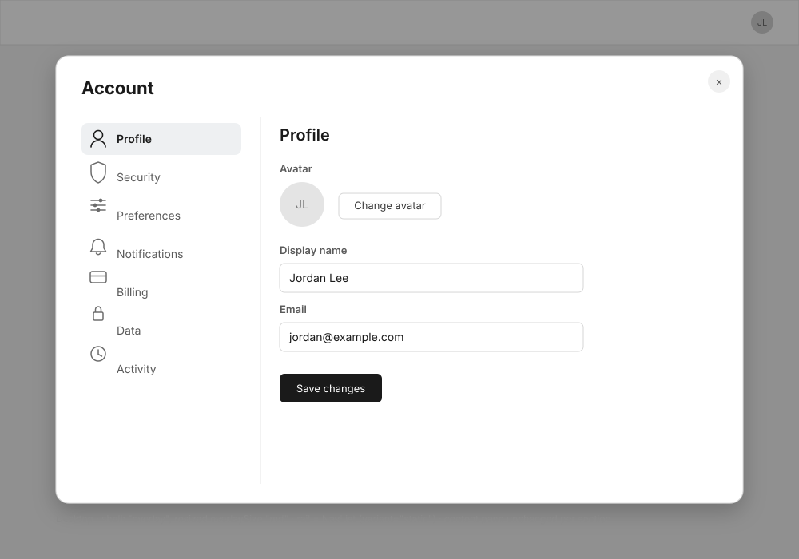

# Account vertical nav — wireframe

**Task:** [epic 14.5](../epics/plugin-accounts.md#-145--vertical-section-nav-for-account-re-scoped-from-rfc-0085) · **RFC:** [0085](../rfcs/0085-vertical-section-nav-overlay-shell.md)

## Problem

Account renders its 7 sections (Profile, Security, Preferences, Notifications,
Billing, Data, Activity) as a horizontal `.tabs`/`.tab` strip at the top of a
full-screen (`overlaySize: "lg"`) dialog. Full detail on why this is changing
lives in RFC 0085 and task 14.5 — not repeated here.

## Direction (confirmed with developer)

- **Shell stays `"overlay"`.** No change to `plugins/account/manifest.json`'s
  `shell` field.
- **Horizontal tabs → vertical nav.** Replace `.tabs`/`.tab` with
  `@sovereignfs/ui`'s existing `NavList` (`variant="static"`), one ungrouped
  group of the 7 sections, each with an icon.
- Dialog resizes `overlaySize: "lg" → "md"` so the rail-plus-content layout
  doesn't sprawl edge-to-edge.
- `<h1>Account</h1>` becomes a compact header sitting above the rail column
  only — not spanning the full dialog width.

No jargon-translation table needed — this task changes navigation
container/layout only; the section content and its copy are unchanged.

## Screens

### 1. Desktop, inside the dialog — `01-desktop-overlay.svg`

Shows the resized `md` dialog with the scrim/backdrop still visible behind it
(the shell stays an overlay, not a full page) — the vertical rail on the left
(`NavList`, `Profile` active per real `.rowActive` styling: background fill +
semibold text, no left accent bar), and the existing Profile section content
unchanged on the right (Avatar / Display name / Email).

**Notes:**

- Icons shown are indicative placeholders (person / shield / sliders / bell /
  card / lock / clock) — final icons come from `packages/ui`'s curated
  `Icon` set; confirm/add via `scripts/icon-list.ts` per task 14.5's
  deliverables.
- Close control (top-right ×) and the scrim are existing `Dialog` chrome,
  unchanged by this task.
- Exact `md` box dimensions are illustrative here — task 14.5 leaves the
  final pixel sizing to be refined visually against Account's widest section
  (Security).

### Screens intentionally not redesigned

- **Mobile.** Stays exactly as today: the horizontal scrollable strip handed
  up to the Dialog's `OverlayHeader` via `useOverlaySecondRow`. No wireframe
  needed — nothing changes.
- **The 6 other sections' own content** (Security, Preferences,
  Notifications, Billing, Data, Activity). Only the navigation container
  changes; each section's internal layout is out of scope for this task.

## Engineering notes

Already covered in task 14.5's Deliverables — see
[docs/epics/plugin-accounts.md](../epics/plugin-accounts.md#-145--vertical-section-nav-for-account-re-scoped-from-rfc-0085).
Not duplicated here to avoid drift between two copies of the same list.

## Open questions

None outstanding — RFC 0085's open questions relevant to Account (title
placement, standalone hard-nav route treatment) were already resolved during
task 14.5's scoping.

## Phased plan

Single phase — matches task 14.5 as scoped (component reuse + dialog resize

- migration, small enough for one branch/PR per the RFC's own Adoption path
  reasoning).
